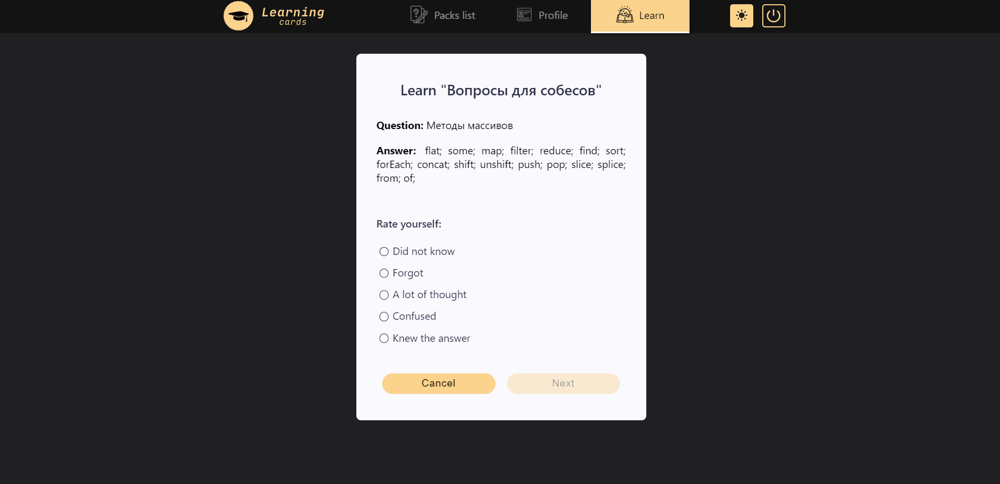

# Learning cards

### [Website](https://mr-g3ntl3man.github.io/Learning_cards)

A card learning app where you can create your own decks and cards to study and review material and learn from other
people's cards. There is also a profile where you can change your information. There is a login, registration and
password recovery.

<h2 align="center">
To use, register or use a test account:
 
 Email: pahoxi1674@alfaceti.com
 
Password: test_test
</h2>

## UI Screenshots

## Stack

- [React](https://ru.reactjs.org/) - JavaScript library for creating user interfaces.
- [Redux](https://redux.js.org/) - A Predictable State Container for JS Apps.
- [Other dependencies](https://github.com/Mr-G3ntl3man/Learning_cards/blob/main/package.json)